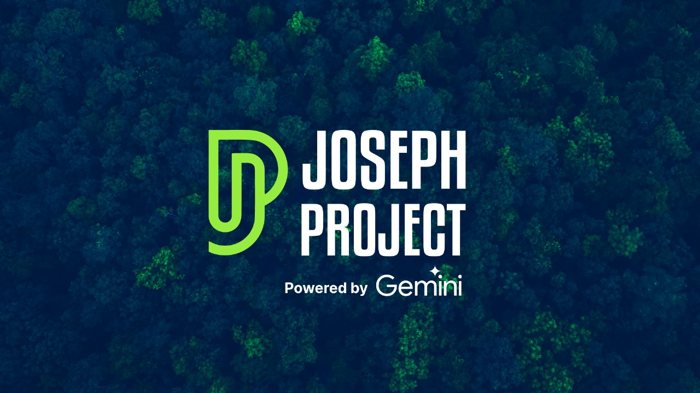

## JOSEPH PROJECT - Gemini API Developer Competition - #buildwithgemini
Gemini Express App This is a Node.js application built with Express that integrates Google's Gemini AI API.



### Features

- Integration with Google's Gemini AI API
- Support for live reload using `nodemon`
- Modeling and data science with python and R (_for more information, read the readme.md of each module_)
- This project has a visual extension, where you can find the source code here: [joseph-project](https://github.com/devluisclaudio/joseph-project.git) | Website: [josephproject.com.br](https://josephproject.com.br/)

### Requirements

- Node.js - [Download](https://nodejs.org/en/download/package-manager)

### Installation

1. Clone the repository:
```bash
git clone git@github.com:mactavishkkk/joseph.git
```

2. Access the root folder:
```bash
cd joseph
```

3. Install the dependencies:
```bash
npm install
```

4. Use the `.env.example` file to create the `.env` file:

5. Now create a production environment with:
```bash 
npm run start
```

- Or a development environment
```bash
npm run dev
```

6. Now the welcome route should be at: `http://localhost:3000/`

### More about

Inspired by the story of Joseph of Egypt, who interpreted dreams, the Joseph Project was created with the purpose of anticipating environmental crises in the Amazon. 

By analyzing vast sets of historical data, NASA satellite data, studies and other diverse data in real time, our model predicts climate and hydrological events, generating important insights, allowing decision-makers and local communities to prepare for and mitigate impacts.

#### Vitor Hugo Schunemann
Project Coordinating Biologist | [Linkedin](https://www.linkedin.com/in/vitor-hugo-schunemann-vargas-20482b229/)

Vitor Hugo Schunemann, a biologist graduated from the Federal University of Santa Maria (UFSM) and has a master's degree in tropical ecology from the National Institute of Amazonian Research (INPA). 

I ​​work in the field of theoretical and applied ecology, especially developing computational models applied to biology. 

Predictive theoretical models about future ecosystem conditions are some of the things that motivate me most within environmental sciences, and being able to combine them with artificial intelligence in order to serve the public good is a unique opportunity.

##### References:

- References for this project and others can be found here [Google Drive](https://drive.google.com/drive/folders/1Z01WqFLOcyfh9SfDYfQhnAHoVkHAASvf)
